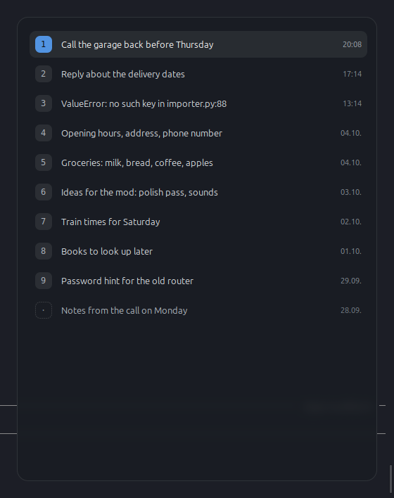

# Zettel

A scratchpad for the Linux desktop. Not an editor.

*Zettel* is German for a slip of paper — the kind you scribble on and throw
away, or keep on your desk for a fortnight.

`F4` brings it up, `F4` puts it away. In between, it still says whatever it
said last time.



## Install

```
git clone git@github.com:JulianBvW/Zettel.git
cd Zettel
/usr/bin/python3 install.py
```

It asks five things and suggests an answer to each, so Enter all the way
through is a reasonable install. The notes folder is named in your own
language, the window is sized from your screen, and the shortcut is checked
against the ones your desktop already holds before it is taken.

`/usr/bin/python3`, not `python3`: on a machine with conda or miniforge in the
PATH the latter has no `gi`, and the script says so rather than failing at the
next login.

The package is copied to `~/.local/share/zettel`, so the clone can be moved or
deleted afterwards. `--in-place` wires it to the current folder instead, which
is what you want while working on it. `--uninstall` takes everything back off
and leaves the notes alone.

Cinnamon only, for now: the shortcut and the panel icon both go through
Cinnamon's own interfaces.

## Why

For the note that lives two minutes, and for the one that stays two weeks.
For the error message you want to look at properly. And for stripping the
formatting off text you copied from a web page, before it ends up somewhere
else.

None of that warrants a text editor. An editor manages files — a scratchpad
has none. So there is no save dialog, no file picker, and no question when
you close it.

## Keys

| Key | |
|---|---|
| `F4` | open → list of notes · when open: close |
| `1`–`9` | open that note |
| `` ` `` | new note |
| `Del` | put that note in the trash |
| `Shift`+`F4` | straight into a new note, skipping the list |
| `Alt`+`←` | back to the list |
| `Esc` | close |
| right click | copy if something is selected, otherwise paste |

There is also an icon in the panel: left click opens and closes it, right
click offers the notes folder and a way to quit. It is there for the day the
shortcut does not fire.

Drag any edge or corner to resize, `Alt`+drag to move it. Where you put it and
how big you made it are remembered, in `~/.config/zettel/state.json`.

Leaving saves the note if there is anything in it, and drops it if there
isn't. Holding `Shift` always discards. Emptying a note and closing it deletes
it for good — no button, no question.

`Del` in the list is the findable way to get rid of one. That one goes to the
desktop trash, because it is a single keystroke and ought to be taken back.

## Why it stays running

A program that *starts* when you press a key takes half a second to appear,
which is exactly long enough to lose the thought you meant to write down.
Zettel therefore runs in the background and only shows a window.

That costs about 15 MB and no measurable CPU time while idle. A single browser
tab uses thirty-eight times as much.

## Built with

Python 3, GTK 3, GtkSourceView — nothing a Linux Mint system doesn't already
have.

Notes are stored as plain text in `~/Notizen/`.

## Licence

MIT. See [LICENSE](LICENSE).

## Blur, if you want it

Zettel paints itself translucent, which is all a program can do: an X11
window owns only its own buffer and never sees what is behind it. Blurring
the backdrop is the compositor's job.

Entirely optional, and only on Cinnamon with the
[BlurCinnamon](https://cinnamon-spices.linuxmint.com/extensions) extension
installed. Without it Zettel works exactly the same and is simply see-through
rather than frosted.

In the extension's settings, under *Component specific settings* → *Windows*,
switch on *Enable window effects* and add an entry:

| Field | Value |
|---|---|
| Application | `Zettel` |
| Custom | on |
| Opacity | 100 |
| Dim | 0 |
| Background | Dual Kawase dynamic blur |
| Intensity | 18 |
| Saturation | 125 |
| Corner Radius | 16 |
| Rounded Top / Bottom | both on |

*Opacity* fades the whole window including the text, and *Dim* darkens the
backdrop a second time — Zettel already brings its own 72 %, so leave both
alone. The corner radius has to match the window's own 16 px, or the blur
pokes out past the rounded corner.

Without a blurred backdrop, 72 % over a busy wallpaper is hard to read.
`BG_RGBA_NO_BLUR` in `zettel/config.py` holds a denser value for that case.

## Tests

No test runner to install. Run either file directly:

```
/usr/bin/python3 tests/test_notes.py               # storage, no display needed
/usr/bin/python3 tests/test_state.py               # window geometry, likewise
/usr/bin/python3 tests/test_config.py              # the settings file
/usr/bin/python3 tests/test_install.py             # what the installer works out
DISPLAY=:0 /usr/bin/python3 tests/test_saverule.py # drives the editor
```

## Status

Work in progress, but usable. Every key in the table above works, the list is
there — notes sorted by when you last changed them, titled by their own first
line — and the window looks the way it is meant to.

Finished, and in daily use. What it does is in the table above; what it will
never do is in the next section.

## What it will not do

No formatting, no Markdown rendering, no syntax highlighting. No search, no
tags, no folders. No synchronisation. No settings window. No buttons, no
toolbar, no menu bar, no title bar.

Every one of those is an invitation to turn a slip of paper into an editor.
